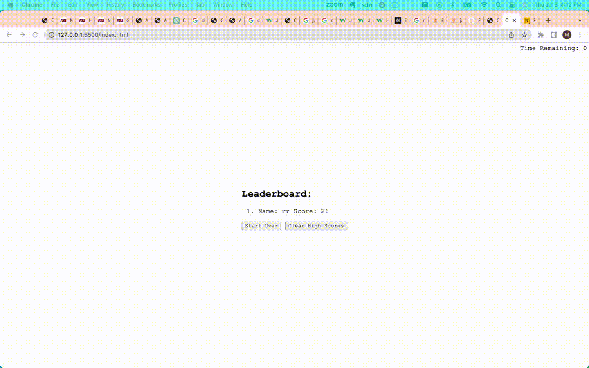

# Code Quiz

## Description

This quiz was created as a way to quiz myself and others on their javascript knowledge.
If you can answer all of the questions within the timeframe, you are well on your way to becoming a javascript expert!

In constructing this quiz application, I learned a ton about javascript. 
I now feel exremely confident with the DOM, as well as writing functions, saving data to local storage, and creating/accessing objects.

## User Story
```
AS A coding boot camp student
I WANT to take a timed quiz on JavaScript fundamentals that stores high scores
SO THAT I can gauge my progress compared to my peers
```
## Acceptance Criteria
```
GIVEN I am taking a code quiz
WHEN I click the start button
THEN a timer starts and I am presented with a question ✔️
WHEN I answer a question
THEN I am presented with another question ✔️
WHEN I answer a question incorrectly
THEN time is subtracted from the clock ✔️
WHEN all questions are answered or the timer reaches 0
THEN the game is over ✔️
WHEN the game is over
THEN I can save my initials and score ✔️
```

## Table of Contents (Optional)


- [Installation](#installation)
- [Usage](#usage)
- [Credits](#credits)
- [License](#license)

## Installation

NA

## Usage

Site URL: https://matt11moriarty.github.io/code-quiz/

1. Start the quiz with the button
2. Timer and quiz starts
3. By answering a question, you will advance to the next
   1. Incorrect answers will subtract 15 seconds from your timer, so be careful!
4. Your final score is the time remaining 
5. Enter your initials to claim your spot on the leaderboard!
   1. Form submission only allows you to enter two letters
   2. Leaderboard is sorted by score
6. Feel free to try again, or let your friend try by clicking the Start Over button
7. If you want to clear the leaderboard, click the Clear High Scores button.





## Credits

- how to hide an element on click with js
  - https://stackoverflow.com/questions/5515527/javascript-onclick-hide-div

- using datasets
  - https://developer.mozilla.org/en-US/docs/Web/API/HTMLElement/dataset

- settimeout
  - https://developer.mozilla.org/en-US/docs/Web/API/setTimeout

- restrictions on form submission
  - https://stackoverflow.com/questions/19508183/how-to-force-input-to-only-allow-alpha-letters
  - https://www.tutorialspoint.com/How-to-limit-the-number-of-characters-allowed-in-form-input-text-field

- clearing out html children
  - https://stackoverflow.com/questions/3955229/remove-all-child-elements-of-a-dom-node-in-javascript

- reset method
  - https://www.w3schools.com/JSREF/met_form_reset.asp

- convert to gif
  - https://cloudconvert.com/webm-to-gif
## License

NA

## Badges

NA

## Features

NA

## How to Contribute

NA

## Tests

NA
